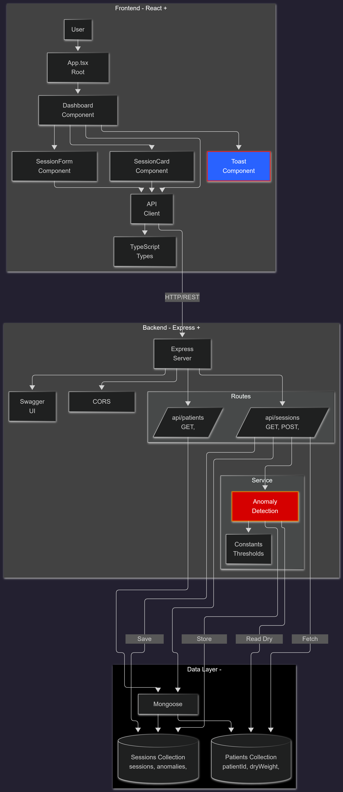

# Dialysis Session Intake & Anomaly Dashboard

A full-stack application for tracking dialysis sessions, managing patient data, and detecting clinical anomalies in real-time.

### Tech Stack

- Node.js
- Express
- MongoDB
- React(Vite) with TypeScript
- Tailwind CSS
- Swagger UI
- Vitest

## Setup

1. **Clone the repository**
   ```bash
   git clone https://github.com/sksmagr23/janoHealth_assignment1.git
   cd janoHealth_assignment1
   ```

2. **Install backend dependencies**
   ```bash
   cd backend
   npm install
   ```

3. **Install frontend dependencies**
   ```bash
   cd frontend
   npm install
   ```

4. **Configure MongoDB and environment variables**
   
   - Create a `.env` file in the `backend` directory:
     ```
     MONGODB_URI=mongodb+srv://<username>:<password>@cluster.mongodb.net/patient-dialysis
     PORT=3001
     CORS_ORIGIN=http://localhost:5173
     ```
   - Create a `.env` file in the `frontend` directory:
     ```
     VITE_API_URL=http://localhost:3001/api
     ```

5. **Seed the database**
   ```bash
   cd backend
   npm run seed
   ```

6. **Start the backend server**
   ```bash
   cd backend
   npm run dev
   ```
   Server will run on `http://localhost:3001`

7. **Start the frontend (in a new terminal)**
   ```bash
   cd frontend
   npm run dev
   ```
   Frontend will run on `http://localhost:5173`

8. **Access the application**
   - Live Frontend: http://localhost:5173
   - Swagger API Docs: http://localhost:3001/api-docs


## Architecture Diagram



### Key API Endpoints

- `POST /api/patients` - Register a new patient
- `GET /api/patients` - List all patients (optional unit filter)
- `POST /api/sessions` - Record a new dialysis session
- `PATCH /api/sessions/:id` - Update a session (notes, vitals, etc.)
- `GET /api/sessions/today` - Get today's schedule with anomalies

## Key Features

### Backend
- Patient registration with dry weight
- Session recording with pre/post weights and vitals
- Real-time anomaly detection
- Today's schedule with patient details
- Filter by unit and anomalies
- Swagger API documentation

### Frontend
- Today's schedule dashboard
- Session status indicators (not started/in progress/completed)
- Anomaly highlighting
- Add new sessions (along with proper rules & guidelines)
- Edit session notes and details
- Filter by unit and anomalies only
- Loading and error states
- Responsive design with Tailwind CSS

## Clinical Assumptions & Trade-offs

### Anomaly Detection Thresholds

#### 1. <u>Excess Interdialytic Weight Gain</u>
- **Threshold**: 5% of dry weight
- **Rationale**: 
  - Normal interdialytic weight gain: 2-3% of dry weight
  - 5% is a conservative threshold that flags potentially concerning fluid retention
  - Exceeding this may indicate dietary non-compliance or cardiac issues
- **Trade-off**: Lower threshold (3%) would catch more cases but increase false positives

#### 2. <u>High Post-Dialysis Systolic BP</u>
- **Threshold**: 140 mmHg
- **Rationale**:
  - Post-dialysis BP should ideally be < 140/90 mmHg
  - Elevated post-dialysis BP can indicate inadequate fluid removal or hypertension
- **Trade-off**: Could use 130 mmHg for stricter monitoring, but 140 is clinically accepted

#### 3. <u>Abnormal Session Duration</u>
- **Minimum**: 150 minutes (2.5 hours)
- **Maximum**: 300 minutes (5 hours)
- **Target**: 240 minutes (4 hours)
- **Rationale**:
  - Typical dialysis sessions: 3-4 hours
  - Shorter sessions may indicate patient intolerance or machine issues
  - Longer sessions may indicate inadequate clearance or complications
- **Trade-off**: Could be more lenient, but these bounds catch significant deviations

### Data Model Decisions

1. **Embedded vs Referenced**: 
   - Patient data is referenced (not embedded) in sessions for data consistency
   - Patient details are joined at query time for today's schedule

2. **Anomaly Storage**:
   - Anomalies are stored as an array in the session document
   - Allows for historical tracking and quick filtering
   - Trade-off: Slightly larger documents, but faster queries

3. **Status Management**:
   - Three states: `not_started`, `in_progress`, `completed`
   - Simple state machine for session lifecycle

### API Design Trade-offs

1. **Today's Schedule Endpoint**:
   - Single endpoint with query parameters for filtering
   - Trade-off: Could have separate endpoints, but this reduces complexity

2. **Anomaly Detection**:
   - Runs synchronously on create/update
   - Trade-off: Could be async, but synchronous ensures immediate feedback

3. **Error Handling**:
   - Returns descriptive error messages
   - Trade-off: Could be more generic for security, but helpful for development

## Testing

**Backend:**
```bash
cd backend
npm test
```

**Frontend:**
```bash
cd frontend
npm test
```

### Test Coverage

- **Anomaly Detection Service**: Unit tests for all threshold scenarios
- **Patients API Route**: Integration tests for create and list operations
- **SessionCard Component**: Component rendering and interaction tests

## API Documentation

Interactive API documentation is available at:
- **Swagger UI**: http://localhost:3001/api-docs

### Clinical Thresholds

Thresholds can be adjusted in `backend/src/config/constants.ts`:

```typescript
export const ANOMALY_THRESHOLDS = {
  MAX_WEIGHT_GAIN_PERCENT: 0.05,  // 5%
  HIGH_SYSTOLIC_BP: 140,           // mmHg
  MIN_SESSION_DURATION: 150,      // minutes
  MAX_SESSION_DURATION: 300,       // minutes
  TARGET_SESSION_DURATION: 240,   // minutes
};
```

## Known Limitations

1. **No Authentication**: Currently no user authentication or authorization
2. **No Historical Analysis**: Limited to today's schedule; no historical trends
3. **Single Unit Focus**: While filtering exists, the UI is optimized for single-unit workflows
4. **No Real-time Updates**: Requires manual refresh to see updates
5. **Basic Anomaly Detection**: Uses simple thresholds; could be enhanced with ML models
6. **No Patient Search**: Patients must be selected from dropdown
7. **No Export Functionality**: Cannot export session data

## Future Improvements

1. **Authentication & Authorization**: Add user roles (nurse, admin, etc.)
2. **Real-time Updates**: WebSocket integration for live updates
3. **Patient Search**: Add search/filter for patient selection
4. **Historical Views**: Dashboard for past sessions and trends
5. **Export**: CSV/PDF export of session data
6. **Advanced Anomaly Detection**: Machine learning models for pattern recognition
7. **Predictive Analytics**: Forecast patient outcomes based on historical data

## AI Tools Usage (using Cursor)

### What AI Was Used For

1. Boilerplate Generation: Initial project structure, TypeScript configurations, and basic component templates
2. Architecture Brainstorming: Discussion of data model choices (embedded vs referenced, schema design)
3. Code Patterns: Consistent error handling, API response formatting, and React component patterns
4. Documentation: Initial README structure and API documentation comments along with Swagger UI
5. Architecture Diagram using Mermaid.Ai

### What Was Manually Reviewed and Changed

1. Clinical Thresholds: All anomaly detection thresholds were manually reviewed and adjusted based on clinical guidelines
2. Data Model: Patient-Session relationship was refined after reviewing MongoDB best practices
3. UI/UX: Component layouts, styling, and user flows were manually designed and iterated
4. Error Messages: All user-facing error messages were crafted for clarity

### Example of Disagreement with AI

**AI Suggestion**: Store patient data embedded in sessions for faster queries.

**My Decision**: Use references instead.

**Reasoning**: 
- Embedded data would lead to data inconsistency if patient details change
- Dry weight updates wouldn't reflect in historical sessions
- Referenced approach maintains data integrity and allows for accurate historical analysis
- The slight performance trade-off is worth the data consistency

## *Authored by sksmagr23 (Saksham Agrawal)*
